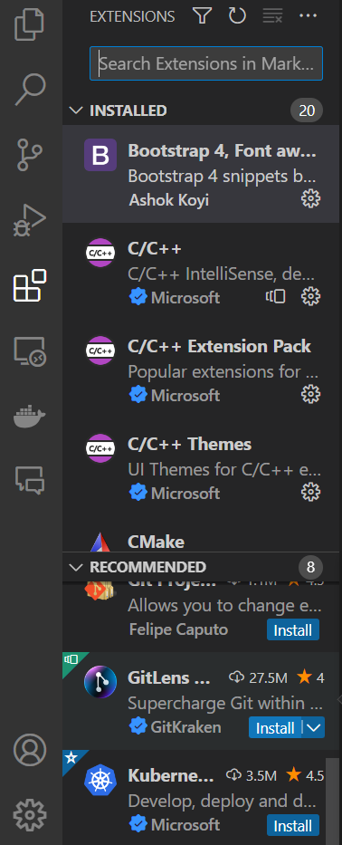
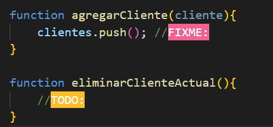

# Extensiones en VS Code

## Definiciones
Las extensiones son complementos modulares que añaden funcionalidades adicionales a Visual Studio Code, permitiéndole a uno personalizar y ampliar su entorno de desarrollo y hacer ciertas tareas más sencillas y eficientes.

## Demostración práctica
### Instalación
- La instalación es tan sencilla como:
    1. Abrir la barra lateral de extensiones(Ctrl+Shift+X)
    2. Usar el buscador para encontrar la extension que se desee installar
    3. Hacer click en el boton **instalar** (En esa misma interfaz tambien están las opciones para desinstalar o deshabilitar la extension en caso de así quererlo)

- En la barra lateral de extensiones se pueden encontrar las extensiones instaladas y también se pueden encontrar recomendaciones en base a las extensiones instaladas y los archivos en los que estes trabajando

    

- Uno puede investigar y descubrir otras extensiones interesantes en el [Marketplace](https://marketplace.visualstudio.com/vscode)

- Es recomendable ver la calificación de la extensión antes de instalarlo, ya que pueden haber varias extensiones con la misma funcionalidad, usualmente el que tenga mejor rating va a ser el de mayor calidad y consistencia.

- Entonces si por ejemplo instalo la extension TODO Highlight,  ahora podria hacer uso de sus features, en este caso destacar ciertos comentarios

## Recomendaciones de uso

Ahora hablaremos sobre algunas extensiones populares y sus usos:

- **ESLint :** Una vez instalado ESLint (con npm) esta extension es muy util para agilizar el uso del linter.\
Recomendable para equipos de desarrollo que usen ESLint en sus proyectos.

- **Prettier :** Es un formateador de código. Util para forzar un estilo en particular, recordar que al contrario que un linter este es solo un formateador, no corregira errores ni problemas en el código.\
Recomendado para grupos de desarrollos que deseen mantener un estilo consistente.

- **Live Server :** Ejecuta un servidor local para visualizar una pagina en tiempo real, los cambio efectuados en el código tambien seran actualizados en la página en tiempo real.\
Util para proyectos de desarrollo web.

- **Git Graph :** Provee una interfaz para ver el *graph* de un repositorio git sin necesidad de ejecutar el comando en la terminal, tambien permite realizar otras acciones desde la interfaz.\
Nunca pueda faltar para cualquier proyecto que use git.

- **GitLens :** Permite tener acceso rapido a información util sobre el repo y sus commits, como pueden ser comparar versiones de un archivo a lo largo del historial de commit, saber quien escribió que, entre otros. \
Escencial para cualquier proyecto extenso que use git, recomendable usar junto a Git Graph.

- **Intellisense :** Es un termino que se usa para características de edición de código como pueden ser *code completion*,*content assist* y *code hinting*. Existen extensiones que dan acceso a estas funciones para varios lenguajes populares, como Python,C/C++,java,PHP,Ruby,etc.\
Extremandamente recomendable usar la extension del lenguaje en el que se esté desarrollando.

* **Otras extensiones :**
Algunas extensiones de menor impacto, par que aún así siempre tienen uso en cualquier tipo de proyecto:
    - Path Intellisense : Facilita la excritura de rutas de archivos en el código.
    - TODO Highlight : Permita resaltar ciertos comentarios en código, como "**TODO:**" ,"**FIXME:**" o "**NOTE:**", util para identificar rapidamente áreas en el código que requieren atencion.
    - Image Preview : Permite poder tener una preview de las imágenes que se usten usando en el código.
    - vscode-pdf : Para visualizar archivos .pdf directamente en VS Code sin tener que abrir un lector de pdf en otra ventana.

## Recursos de aprendizaje

- Marketplace de VS Code: Ahí buscamos extensiones que nos hayan resultado interesantes para hablarlas.
- Páginas de las extensiones en el Marketplace: Para averiguar que hacen y como funciona cada extension revisamos su documentación en sus respectivas páginas del Marketplace
- Otras páginas/blogs : En caso de querer ver más a detalle ciertas extensiones y ejemplos, encontramos páginas/blogs hablando expresamente sobre las mismas.
- ChatGPT: Lo usamos para agilizar el proceso de encontrar extensiones utiles y populares de las que hablar.

## Fuentes

Fuentes usadas para la presentacion y ficha tecnica:
- https://marketplace.visualstudio.com/vscode
- https://code.visualstudio.com/docs/editor/extension-marketplace
- https://code.visualstudio.com/docs/editor/intellisense
- https://marketplace.visualstudio.com/items?itemName=esbenp.prettier-vscode
- https://www.digitalocean.com/community/tutorials/how-to-format-code-with-prettier-in-visual-studio-code
- https://marketplace.visualstudio.com/items?itemName=dbaeumer.vscode-eslint
- https://marketplace.visualstudio.com/items?itemName=ritwickdey.LiveServer
- https://marketplace.visualstudio.com/items?itemName=mhutchie.git-graph
- https://marketplace.visualstudio.com/items?itemName=eamodio.gitlens
- https://keepcoding.io/blog/extensiones-en-vsc-gitlens/
- https://marketplace.visualstudio.com/items?itemName=yzhang.markdown-all-in-one
- https://marketplace.visualstudio.com/items?itemName=christian-kohler.path-intellisense
- https://marketplace.visualstudio.com/items?itemName=wayou.vscode-todo-highlight
- https://marketplace.visualstudio.com/items?itemName=kisstkondoros.vscode-gutter-preview
- https://code.visualstudio.com/blogs/2023/03/30/vscode-copilot

