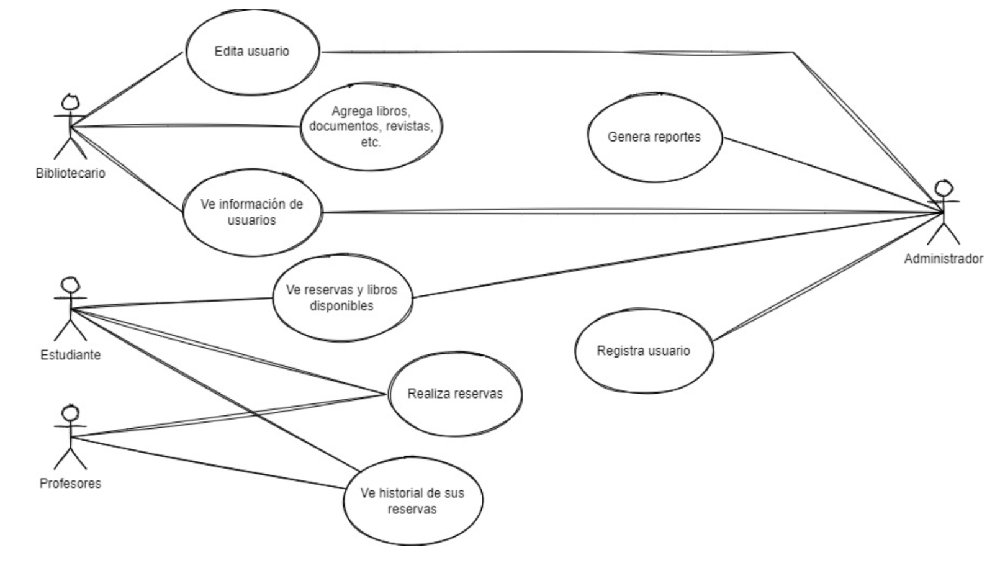

### Mateo Dominguez (253432) - Delfina Olaso (281981) - Fiorella Rohner (293150)

# Elicitación de requerimientos

Para comenzar definiremos elicitación y requerimiento, además de otros términos relevantes para comprender mejor el tema.

- Elicitación es un término asociado a la psicología que se refiere al traspaso de información de forma fluida de un ser humano a otro por medio del lenguaje.
- Los requerimientos de un sistema son descripciones de lo que el sistema debe hacer, incluyen el servicio que ofrece y las restricciones de operación.
- La ingeniería de requerimientos de un sistema. Es el proceso de descubrir, analizar, documentar y verificar los servicios y restricciones del sistema. 

A partir de estos conceptos podemos definir la ***elicitación de requerimientos*** como el proceso de recopilar información sobre el sistema a desarrollar y los sistemas existentes, así como separar los requerimientos del usuario y del sistema a partir de ellos.

En este caso mostraremos las técnicas para elicitar un requerimiento, hay muchas técnicas de elicitación, algunas son:

- Entrevistas
- Escenarios 
- Casos de uso
- Etnografía  y/u observación in situ
- Lluvia de ideas 

### Entrevistas 

El equipo de ingeniería de requerimientos formula preguntas sobre el sistema que está en uso y el sistema que está en proceso de desarrollo, los requerimientos salen de las respuestas a dichas preguntas, existen dos tipos:
Cerradas: Los participantes responden a un conjunto de preguntas preestablecidas.
Abiertas: No hay preguntas preestablecidas sino que se explora un rango de conflicto con los participantes y se obtiene una mejor comprensión de las necesidades. 
Por lo general las entrevistas terminan siendo una combinación de ambas.

### Escenarios

Son ejemplos de interacciones de las personas con el sistema de software que se generan y a partir de la información obtenida en la discusión se formulan los requerimientos del sistema. El escenario incluye las siguientes partes:
- Descripción de qué esperan el sistema y los usuarios cuando comience el escenario.
- Descripción del escenario del flujo normal de eventos.
- Descripción de qué puede salir mal y cómo abordar el problema. 
- Información de otras actividades que estén en marcha al mismo tiempo.
- Descripción del estado del sistema cuando termina el escenario.

### Casos de uso 

Un caso de uso es un artefacto que define una secuencia de acciones que da lugar a un resultado de valor observable. Los casos de uso proporcionan una estructura para identificar actores implicados en una interacción y el tipo de interacción que sirve como guía para obtener requerimientos del sistema acorde a la situación. Los casos de uso pueden representarse como un elemento gráfico en un diagrama y como una especificación de caso de uso en un documento textual.

### Etnografía y/u observación in situ.

Es una técnica de observación que se usa para entender los procesos operacionales y ayuda a derivar requerimientos de apoyo a dichos procesos.
Consiste en observar directamente las prácticas profesionales que se realizan en la organización para la cual se desarrolla el software, ya que al observar cómo los usuarios realizan sus tareas podemos sacar información valiosa para los requisitos.

### Lluvia de ideas 

Es una técnica de reuniones en grupo donde se generan ideas libres de críticas y/o juicios, como técnica ayuda a generar una variedad de vistas al problema y a formularlo de distintas formas, sobre todo al principio cuando los requerimientos aún están muy difusos.

## Demostración práctica.

Se plantea una situación hipotética en la que se le pide a la clase elaborar un sistema para los préstamos de la biblioteca de la universidad.

- Entrevistas: en este caso la clase realizaría preguntas tanto a estudiantes, como profesores y bibliotecarios. Por ejemplo, a los bibliotecarios se les podría realizar preguntas como: ¿cómo gestionan actualmente los préstamos en la biblioteca?, ¿qué problemas tienen con el proceso actual de gestión de préstamos?, ¿qué puntos quieren mejorar?. A los estudiantes y profesores se les podría realizar preguntas como: ¿de qué forma suelen buscar libros o documentos (a partir del autor, el título, ISBN, etc.)?, ¿qué funciones específicas les gustaría tener en el sistema?

- Casos de uso:

## Recomendaciones de uso.

- En las entrevistas:
    - Se recomienda que sea abierta pero sin perder el foco en el sistema que se va a desarrollar 
    - Utilizar en conjunto con otras técnicas para no perder información organizacional y de soluciones actuales
    - Un entrevistador efectivo debe ser abierto y activo durante la entrevista generando nuevas preguntas para junto con el entrevistado trabajar en la generación de un prototipo.
- Tener en cuenta el contexto social y organizacional en los requerimientos del sistema.
- En los casos de uso los diagramas deben acompañarse de una descripción textual.
- Utilizar varias técnicas al realizar la elicitación, no utilizar solamente una.

## Recursos de aprendizaje.

- ChatGPT: para pedirle ejemplos de problemas en los que se podrían practicar las técnicas.
- Draw.io: para realizar esquemas de casos de usos
- Libro “Ingeniería de software” (9a. ed.) de Sommerville: se encuentran desarrolladas la mayoría de las técnicas mencionadas en detalle.
- Elicitación de requisitos | Análisis y Desarrollo de Software SENA (https://www.youtube.com/watch?v=yit5MYr6w3o): para un análisis más profundo, con un enfoque detallado en las entrevistas.

## Fuentes de información

- Sommerville, I. (2011). Ingeniería de software (9a. ed.). México, D.F, Mexico: Pearson Educación. Recuperado de https://elibro.net/es/lc/elibroort/titulos/37857.
- Colaboradores de Wikipedia. (2023). Elicitación. Wikipedia, la enciclopedia libre. https://es.wikipedia.org/wiki/Elicitaci%C3%B3n
- Técnicas de elicitación de requisitos | Marco de Desarrollo de la Junta de Andalucía. (n.d.). https://www.juntadeandalucia.es/servicios/madeja/contenido/recurso/415
- GPT-3.5. (2023, 11 de setiembre). Prompt: Técnicas de elicitación de requerimientos.  OpenAI's GPT-3.5.
- IBM documentation. (n.d.). https://www.ibm.com/docs/es/engineering-lifecycle-management-suite/lifecycle-management/6.0.3?topic=requirements-defining-use-cases